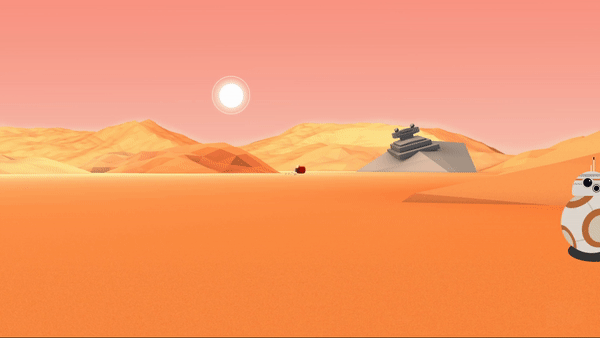

# 🚀 30diasDeCSS 🚀

  Bom dia/tarde/noite, tudo bom ?  
  
  30 dias de CSS3 é um desafio que visa melhorar minhas habilidades em HTML5 e CSS3 através da realização de mini projetos diários.
  Todos os créditos à [@MilenaCarecho](https://twitter.com/MilenaCarecho) 😄

 # Objetivo

  30 dias de CSS3 é um desafio que vou aceitar (e você também pode participar) a partir de 20 de Julho de 2020 (estou começando dia 29), que visa melhorar minhas habilidades em       HTML5 e CSS3 através da realização de projetos 
  
  # Regras gerais

  * Realizar um projeto por dia
  * Compartilhe seu progresso nas mídias sociais (Twitter, Facebook, Linkedin etc.) usando a hashtag #30diasDeCSS
  * O projeto deve ser concluído até 23:59

  # Regras pra mim 
  Vou aderir as regras tambem hihi, mas vou fazer uma alteração, lembrando que não é obrigação, fique à vontade para fazer o mesmo, se quiser!

  * Se eu não concluir o projeto do dia, as 5 primeiras pessoas a apontar no Twitter [@Ricardinho_tremetreme](https://twitter.com/Ricardo_Zamboni) eu vou somar R$5 (total de R$25) numa quantia e ao final dos 30 dias irei doar toda essa quantia a uma instituição(a ser definida ainda).Adicionando um pouco de motivação para mim! 💸
  
  Gostou da ideia? 
  [Clique aqui](https://github.com/MilenaCarecho/30diasDeCSS/issues/1) para participar 
  
#### Youtube Referencias dos desafios
[Online Tutorials](https://www.youtube.com/channel/UCbwXnUipZsLfUckBPsC7Jog) - 
[Creative Creations](https://www.youtube.com/channel/UCOKmVksbzoKJKmtu7rlEM1A) - 
[DarkCode](https://www.youtube.com/channel/UCD3KVjbb7aq2OiOffuungzw)

#### Achei muito divertido ideia, e desafio todos que tenham interesse 🤗
#### Novamente, todos os créditos à criadora do desafio 👉 [@MilenaCarecho](https://twitter.com/MilenaCarecho) 👈

## Minhas redes sociais
 * [Facebook](https://www.facebook.com/ricardo.zamboni.142/)
 * [LinkedIn](https://www.linkedin.com/in/ricardo-zamboni-3906471b3/)
 * [GitHub](https://github.com/Ricmaloy)
 * [Twitter](https://twitter.com/Ricardo_Zamboni)
  
##### Vou atualizando aqui diariamente, qualquer dúvida estou a disposição 

* [Dia 01 - Ícone de mídia social em camadas](#id01)
* [Dia 02 - Loader animado](#id02)
* [Dia 03 - Mudança de cor de texto quando entra em outra div](#id03)
* [Dia 04 - Botão com efeito](#id04)
* [Dia 05 - Efeito pulsar](#id05)
* [Dia 06 - Efeito lightning text](#id06)
* [Dia 07 - Preloader animado](#id07)
* [Dia 08 - Coração batendo](#id08)
* [Dia 09 - Pêndulo de Newton](#id09)
* [Dia 10 - Animação texto alternando](#id10)
* [Dia 11 - Botão com efeito hover](#id11)
* [Dia 12 - Efeito de texto de preenchimento ao passar o mouse](#id12)
* [Dia 13 - Loading com efeito](#id13)
* [Dia 14 - Fundo de texto animado](#id14)
* [Dia 15 - Texto flutuante](#id15)
* [Dia 16 - Botão com efeito](#id16)
* [Dia 17 - Loader animado](#id17)
* [Dia 18 - Texto esfumaçado](#id18)
* [Dia 19 - Efeitos de animação fundo de partículas](#id19)
* [Dia 20 - Botão com efeito](#id20)
* [Dia 21 - Esferas quicando](#id21)
* [Dia 22 - Icones com efeito](#id22)
* [Dia 23 - Botão com efeito hover](#id23)
* [Dia 24 - Preloader animado](#id24)
* [Dia 25 - Checkbox animado](#id25)
* [Dia 26 - Loading com efeito](#id26)
* [Dia 27 - Efeito pulsar](#id27)
* [Dia 28 - Cor do background mudando](#id28)
* [Dia 29 - Menu responsivo com Media Queries](#id29)
* [Dia 30 - Fogos de artificio](#id30)

##  Desafio dia 01 - Ícone de mídia social em camadas 

##### O que eu aprendi

* *Criar as camadas utilizando a tag ``*
* *[Transições CSS](https://www.w3schools.com/css/css3_transitions.asp)*
* *[Opacidade / transparência do CSS](https://www.w3schools.com/css/css_image_transparency.asp)*
* *[hover](https://www.w3schools.com/cssref/sel_hover.asp)*
* *[nth-child ()](https://www.w3schools.com/cssref/sel_nth-child.asp)*

##  Desafio dia 02 - Loader animado 

##### O que eu aprendi

* *sobrepor elementos utilizando posicionamento [absolute](https://www.w3schools.com/cssref/pr_class_position.asp)*
* *[Animations](https://www.w3schools.com/css/css3_animations.asp)*
* *[@keyframe usando from to](https://www.w3schools.com/cssref/css3_pr_animation-keyframes.asp)*
* *[clip-path: polygon()](https://www.w3schools.com/cssref/css3_pr_clip-path.asp)*

##  Desafio dia 03 - Mudança de cor de texto quando entra em outra div 

##### O que eu aprendi

* *[Animations](https://www.w3schools.com/css/css3_animations.asp)*
* *[HTML video](https://www.w3schools.com/html/html5_video.asp)*
* *[@keyframe usando from to](https://www.w3schools.com/cssref/css3_pr_animation-keyframes.asp)*
* *[Overflow](https://www.w3schools.com/css/css_overflow.asp)*
* *[CSS Text](https://www.w3schools.com/css/css_text.asp)

##  Desafio dia 04 - Botão com efeito 

##### O que eu aprendi

* *[Animations](https://www.w3schools.com/css/css3_animations.asp)*
* *[hover](https://www.w3schools.com/cssref/sel_hover.asp)*
* *[::before](https://www.w3schools.com/cssref/sel_before.asp)*
* *[::after](https://www.w3schools.com/cssref/sel_after.asp)*
* *[Transições ](https://www.w3schools.com/css/css3_transitions.asp)*
* *[Overflow](https://www.w3schools.com/css/css_overflow.asp)*

##  Desafio dia 05 - Efeito pulsar 

##### O que eu aprendi

* *[Animations](https://www.w3schools.com/css/css3_animations.asp)*
* *[Opacidade / transparência do CSS](https://www.w3schools.com/css/css_image_transparency.asp)*
* *[@keyframe](https://www.w3schools.com/cssref/css3_pr_animation-keyframes.asp)*
* *sobrepor elementos utilizando posicionamento [absolute](https://www.w3schools.com/cssref/pr_class_position.asp)*

##  Desafio dia 06 - Efeito lightning text 

##### O que eu aprendi

* *[Animations](https://www.w3schools.com/css/css3_animations.asp)*
* *[Opacidade / transparência do CSS](https://www.w3schools.com/css/css_image_transparency.asp)*
* *[@keyframe](https://www.w3schools.com/cssref/css3_pr_animation-keyframes.asp)*
* *[nth-child ()](https://www.w3schools.com/cssref/sel_nth-child.asp)*

##  Desafio dia 07 - Preloader animado 

##### O que eu aprendi

* *[Animations](https://www.w3schools.com/css/css3_animations.asp)*
* *[@keyframe](https://www.w3schools.com/cssref/css3_pr_animation-keyframes.asp)*
* *[nth-child ()](https://www.w3schools.com/cssref/sel_nth-child.asp)*
* *[transform](https://www.w3schools.com/cssref/css3_pr_transform.asp)*
* *[transform: scale()](https://developer.mozilla.org/pt-BR/docs/Web/CSS/transform-function/scale)*

##  Desafio dia 08 - Coração batendo 

##### O que eu aprendi

* *[Animations](https://www.w3schools.com/css/css3_animations.asp)*
* *[@keyframe](https://www.w3schools.com/cssref/css3_pr_animation-keyframes.asp)*
* *[transform](https://www.w3schools.com/cssref/css3_pr_transform.asp)*
* *[transform: scale()](https://developer.mozilla.org/pt-BR/docs/Web/CSS/transform-function/scale)*
* *[Font Awesome](https://fontawesome.com/icons)*

##  Desafio dia 09 - Pêndulo de Newton 

##### O que eu aprendi

* *[Animations](https://www.w3schools.com/css/css3_animations.asp)*
* *[@keyframe](https://www.w3schools.com/cssref/css3_pr_animation-keyframes.asp)*
* *[Display: flex](https://www.w3schools.com/css/css3_flexbox.asp)*
* *[justify-content](https://www.w3schools.com/cssref/css3_pr_justify-content.asp)*
* *[transform-origin](https://www.w3schools.com/cssref/css3_pr_transform-origin.asp)*

##  Desafio dia 10 - Animação texto alternando 

##### O que eu aprendi

* *[Animations](https://www.w3schools.com/css/css3_animations.asp)*
* *[@keyframe](https://www.w3schools.com/cssref/css3_pr_animation-keyframes.asp)*
* *[::after](https://www.w3schools.com/cssref/sel_after.asp)*

##  Desafio dia 11 - Botão com efeito hover 

##### O que eu aprendi

* *[cubic-bezier](https://www.w3schools.com/cssref/func_cubic-bezier.asp)*
* *[hover](https://www.w3schools.com/cssref/sel_hover.asp)*
* *[::before](https://www.w3schools.com/cssref/sel_before.asp)*

##  Desafio dia 12 - Efeito de texto de preenchimento ao passar o mouse 

##### O que eu aprendi

* *[background-clip](https://www.w3schools.com/cssref/css3_pr_background-clip.asp)*
* *[hover](https://www.w3schools.com/cssref/sel_hover.asp)*
* *[::before](https://www.w3schools.com/cssref/sel_before.asp)*

##  Desafio dia 13 - Loading com efeito 

##### O que eu aprendi

* *[Animations](https://www.w3schools.com/css/css3_animations.asp)*
* *[@keyframe](https://www.w3schools.com/cssref/css3_pr_animation-keyframes.asp)*
* *[nth-child ()](https://www.w3schools.com/cssref/sel_nth-child.asp)*

##  Desafio dia 14 - Fundo de texto animado 

##### O que eu aprendi

* *[Animations](https://www.w3schools.com/css/css3_animations.asp)*
* *[@keyframe](https://www.w3schools.com/cssref/css3_pr_animation-keyframes.asp)*
* *[background-clip](https://www.w3schools.com/cssref/css3_pr_background-clip.asp)*
* *[text-stroke](https://developer.mozilla.org/en-US/docs/Web/CSS/-webkit-text-stroke)*

##  Desafio dia 15 - Texto flutuante 

##### O que eu aprendi

* *[Animations](https://www.w3schools.com/css/css3_animations.asp)*
* *[@keyframe](https://www.w3schools.com/cssref/css3_pr_animation-keyframes.asp)*
* *[rotate()](https://www.w3schools.com/cssref/css3_pr_transform.asp)*
* *[text-shadow](https://www.w3schools.com/cssref/css3_pr_text-shadow.asp)*

##  Desafio dia 16 - Botão com efeito 

##### O que eu aprendi

* *[Animations](https://www.w3schools.com/css/css3_animations.asp)*
* *[@keyframe](https://www.w3schools.com/cssref/css3_pr_animation-keyframes.asp)*
* *[box-shadow](https://www.w3schools.com/cssref/css3_pr_box-shadow.asp)*

##  Desafio dia 17 - Loader animado 

##### O que eu aprendi

* *[Animations](https://www.w3schools.com/css/css3_animations.asp)*
* *[rotate()](https://www.w3schools.com/cssref/css3_pr_transform.asp)*
* *[@font-face](https://www.w3schools.com/cssref/css3_pr_font-face_rule.asp)*
* *[@keyframe usando from to](https://www.w3schools.com/cssref/css3_pr_animation-keyframes.asp)*

##  Desafio dia 18 - Texto esfumaçado 

##### O que eu aprendi

* *[Animations](https://www.w3schools.com/css/css3_animations.asp)*
* *[blur()](https://www.w3schools.com/cssref/css3_pr_filter.asp)*

##  Desafio dia 19 - Efeitos de animação fundo de partículas 

##### O que eu aprendi

* *[Animations](https://www.w3schools.com/css/css3_animations.asp)*
* *[@keyframe](https://www.w3schools.com/cssref/css3_pr_animation-keyframes.asp)*
* *[rotate()](https://www.w3schools.com/cssref/css3_pr_transform.asp)*
* *[nth-child ()](https://www.w3schools.com/cssref/sel_nth-child.asp)*

##  Desafio dia 20 - Botão com efeito 

##### O que eu aprendi

* *[box-shadow](https://www.w3schools.com/cssref/css3_pr_box-shadow.asp)*
* *[hover](https://www.w3schools.com/cssref/sel_hover.asp)*
* *[::before](https://www.w3schools.com/cssref/sel_before.asp)*
* *[Opacidade / transparência do CSS](https://www.w3schools.com/css/css_image_transparency.asp)*

##  Desafio dia 21 - Esferas quicando 

##### O que eu aprendi

* *[Animations](https://www.w3schools.com/css/css3_animations.asp)*
* *[@keyframe](https://www.w3schools.com/cssref/css3_pr_animation-keyframes.asp)*
* *[::after](https://www.w3schools.com/cssref/sel_after.asp)*
* *[::before](https://www.w3schools.com/cssref/sel_before.asp)*

##  Desafio dia 22 - Icones com efeito 

##### O que eu aprendi

* *[hover](https://www.w3schools.com/cssref/sel_hover.asp)*
* *[nth-child ()](https://www.w3schools.com/cssref/sel_nth-child.asp)*
* *[::after](https://www.w3schools.com/cssref/sel_after.asp)*

##  Desafio dia 23 - Icones com efeito 

##### O que eu aprendi

* *[hover](https://www.w3schools.com/cssref/sel_hover.asp)*
* *[::before](https://www.w3schools.com/cssref/sel_before.asp)*

##  Desafio dia 24 - Preloader animado 

##### O que eu aprendi

* *[nth-child ()](https://www.w3schools.com/cssref/sel_nth-child.asp)*
* *[Animations](https://www.w3schools.com/css/css3_animations.asp)*
* *[@keyframe](https://www.w3schools.com/cssref/css3_pr_animation-keyframes.asp)*

##  Desafio dia 25 - Checkbox animado 

##### O que eu aprendi

* *[hover](https://www.w3schools.com/cssref/sel_hover.asp)*
* *[Animations](https://www.w3schools.com/css/css3_animations.asp)*
* *[@keyframe](https://www.w3schools.com/cssref/css3_pr_animation-keyframes.asp)*
* *[label](https://www.w3schools.com/tags/tag_label.asp)*

##  Desafio dia 26 - Loading com efeito 

##### O que eu aprendi

* *[nth-child ()](https://www.w3schools.com/cssref/sel_nth-child.asp)*
* *[Animations](https://www.w3schools.com/css/css3_animations.asp)*
* *[@keyframe](https://www.w3schools.com/cssref/css3_pr_animation-keyframes.asp)*

##  Desafio dia 27 - Efeito pulsar 

##### O que eu aprendi

* *[Opacidade / transparência do CSS](https://www.w3schools.com/css/css_image_transparency.asp)*
* *[Animations](https://www.w3schools.com/css/css3_animations.asp)*
* *[@keyframe](https://www.w3schools.com/cssref/css3_pr_animation-keyframes.asp)*

##  Desafio dia 28 - Cor do background mudando 

##### O que eu aprendi
* *[linear-gradient()](https://www.w3schools.com/css/css3_gradients.asp)*
* *[background-position](https://www.w3schools.com/cssref/pr_background-position.asp)*
* *[Animations](https://www.w3schools.com/css/css3_animations.asp)*
* *[@keyframe](https://www.w3schools.com/cssref/css3_pr_animation-keyframes.asp)*

##  Desafio dia 29 - Menu responsivo com Media Queries 

##### O que eu aprendi
* *[linear-gradient()](https://www.w3schools.com/css/css3_gradients.asp)*
* *[background-position](https://www.w3schools.com/cssref/pr_background-position.asp)*
* *[media querie](https://www.w3schools.com/cssref/css3_pr_mediaquery.asp)*
* *[hover](https://www.w3schools.com/cssref/sel_hover.asp)*
* *[cubic-bezier](https://www.w3schools.com/cssref/func_cubic-bezier.asp)*

##  Desafio dia 30 - Fogos de artificio 

##### O que eu aprendi
* *[Animations](https://www.w3schools.com/css/css3_animations.asp)*
* *[@keyframe](https://www.w3schools.com/cssref/css3_pr_animation-keyframes.asp)*
* *[::before](https://www.w3schools.com/cssref/sel_before.asp)*
